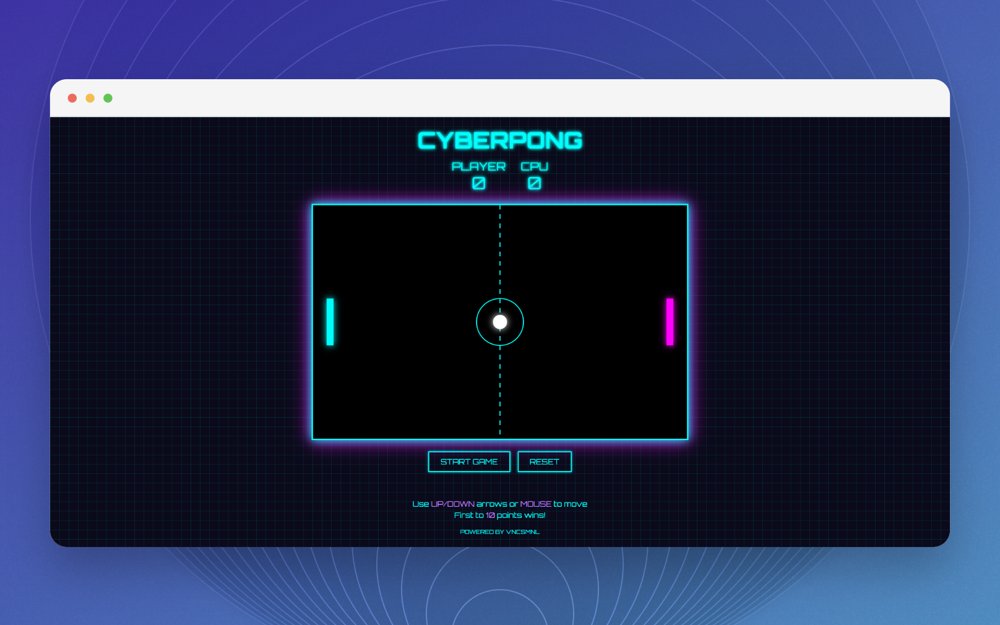

# CyberPong 🎮

A modern, cyberpunk-themed take on the classic Pong game, featuring neon aesthetics and smooth gameplay.

## 🌟 Features

- Retro-futuristic cyberpunk design with neon effects
- Smooth paddle and ball movement
- Player vs CPU gameplay
- Score tracking system
- Responsive controls (keyboard and mouse support)
- Modern visual effects and grid overlay
- First to 10 points wins!

## Screenshots



## 🎯 How to Play

1. Open `index.html` in a modern web browser
2. Click the "START GAME" button to begin
3. Control your paddle using:
   - Up/Down arrow keys
   - Mouse movement
4. Score points by getting the ball past the CPU's paddle
5. First player to reach 10 points wins!
6. Use the "RESET" button to start a new game at any time

## 🛠️ Technologies Used

- HTML5
- CSS3 (with modern animations and effects)
- JavaScript (Vanilla)
- TailwindCSS (via CDN)

## 🎨 Design Features

- Neon-style text and borders
- Cyberpunk-inspired grid overlay
- Responsive game canvas
- Modern UI elements with pulsing effects
- Score display for both Player and CPU

## 🚀 Getting Started

1. Clone this repository:
```bash
git clone https://github.com/yourusername/cyberpong.git
```

2. Navigate to the project directory:
```bash
cd cyberpong
```

3. Open `index.html` in your preferred web browser

No additional setup or dependencies required! The game runs directly in the browser.

## 🎮 Game Controls

- **Up Arrow**: Move paddle up
- **Down Arrow**: Move paddle down
- **Mouse Movement**: Alternative paddle control
- **Start Button**: Begin the game
- **Reset Button**: Reset the current game


## 🔧 Browser Compatibility

The game is compatible with all modern browsers that support HTML5 Canvas:
- Chrome
- Firefox
- Safari
- Edge

## 📄 License

[](https://github.com/vncsmnl/cyberpong/blob/main/LICENSE)

```
            DO WHAT THE FUCK YOU WANT TO PUBLIC LICENSE
                    Version 2, December 2004

 Copyright (C) 2004 Sam Hocevar <sam@hocevar.net>

 Everyone is permitted to copy and distribute verbatim or modified
 copies of this license document, and changing it is allowed as long
 as the name is changed.

            DO WHAT THE FUCK YOU WANT TO PUBLIC LICENSE
   TERMS AND CONDITIONS FOR COPYING, DISTRIBUTION AND MODIFICATION

  0. You just DO WHAT THE FUCK YOU WANT TO.
```